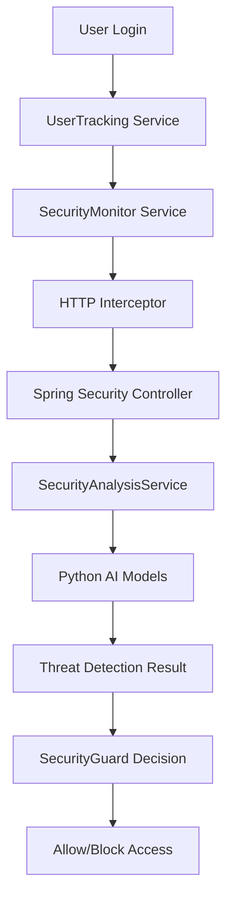

# UBA Research - Comprehensive User Behavior Analytics System

A complete User Behavior Analytics (UBA) system with AI-powered threat detection covering 10 critical security scenarios.

## 🏗️ Architecture

```
├── uba-research/                    # Angular Frontend
├── uba-research-backend/            # Spring Boot Backend  
├── uba-research-pythonAI/           # Python AI Models
└── uba-analytics-library/           # Reusable UBA Components
```

## 🚀 Quick Start

### Prerequisites
- Node.js 18+
- Java 17+
- Python 3.8+
- Maven 3.6+

### Installation
```bash
# 1. Install Python dependencies
cd uba-research-pythonAI
pip install -r requirements.txt

# 2. Start Spring Boot backend
cd ../uba-research-backend
mvn spring-boot:run

# 3. Start Angular frontend
cd ../uba-research
npm install
ng serve
```

Access: `http://localhost:4200`

## 🛡️ Security Scenarios Coverage

### ✅ 1. Penetration & Intrusion Detection
**How it works:** Monitors mouse, keyboard, timing patterns for unauthorized access detection.

**Files:**
- `user-tracking.ts` - Captures behavioral data
- `anomaly_detector.py` - VAE model for pattern analysis
- `AuthController.java` - Validates login attempts

**APIs:**
- `POST /api/auth/login` - Login with behavior analysis
- `POST /detect` - Python AI detection endpoint

**Test:** Login with unusual typing patterns or automated tools.

---

### ✅ 2. Session Hijacking & Identity Spoofing  
**How it works:** Behavioral fingerprinting detects session token misuse.

**Files:**
- `user-tracking.ts` - Session behavior tracking
- `behavior-tracking.interceptor.ts` - Stealth headers
- `vae_model.py` - Identity verification

**APIs:**
- All HTTP requests include behavioral headers
- `POST /detect` - Continuous session validation

**Test:** Use stolen session tokens from different devices/locations.

---

### ✅ 3. Anomalous API/Service Usage
**How it works:** Tracks endpoint access patterns, payload sizes, frequency.

**Files:**
- `behavior-tracking.interceptor.ts` - API call monitoring
- `anomaly_detector.py` - Usage pattern analysis
- `SecurityAnalysisService.java` - API abuse detection

**APIs:**
- All API calls automatically monitored
- `POST /api/security/insider-activity` - Unusual API usage

**Test:** Make rapid API calls or access unusual endpoint combinations.

---

### ✅ 4. Application Layer Attacks
**How it works:** Analyzes payload anomalies and input timing for injection attempts.

**Files:**
- `user-tracking.ts` - Input pattern tracking
- `malware_detector.py` - Payload analysis
- `SecurityController.java` - Attack pattern detection

**APIs:**
- `POST /detect` - Payload anomaly detection
- `POST /api/security/privilege-usage` - Injection attempt logging

**Test:** Submit SQL injection or XSS payloads in forms.

---

### ✅ 5. Account Takeovers (ATO)
**How it works:** IP/location tracking with behavioral pattern changes.

**Files:**
- `user-tracking.ts` - Location and device tracking
- `SecurityMonitorService.ts` - Device fingerprinting
- `enhanced_anomaly_detector.py` - Takeover detection

**APIs:**
- `POST /api/auth/login` - Location-based validation
- `POST /api/security/insider-activity` - Suspicious access logging

**Test:** Login from new locations with different behavioral patterns.

---

### ✅ 6. Data Exfiltration / Leakage
**How it works:** Monitors download patterns, API exports, sensitive screen access.

**Files:**
- `behavior-tracking.interceptor.ts` - Download monitoring
- `SecurityAnalysisService.java` - Exfiltration pattern analysis
- `enhanced_anomaly_detector.py` - Data access anomalies

**APIs:**
- `POST /api/security/data-access` - Data access tracking
- `POST /api/security/insider-activity` - Export monitoring

**Test:** Download multiple files or export large datasets rapidly.

---

### ✅ 7. Insider Threats ⭐ *New*
**How it works:** Tracks authenticated user behavior, time-of-day patterns, role violations.

**Files:**
- `SecurityMonitorService.ts` - Insider activity tracking
- `SecurityAnalysisService.java` - After-hours analysis
- `enhanced_anomaly_detector.py` - Insider threat AI

**APIs:**
- `POST /api/security/insider-activity` - Activity logging
- `POST enhanced_anomaly_detector.py insider` - AI analysis

**Test:**
```typescript
// After login, simulate after-hours access
securityMonitor.trackInsiderActivity('DATA_EXPORT', 'sensitive_files');
```

---

### ✅ 8. Privilege Escalation / Role Abuse ⭐ *New*
**How it works:** Monitors role vs permission mismatches, scope violations.

**Files:**
- `behavior-tracking.interceptor.ts` - Auto-tracks admin API calls
- `SecurityAnalysisService.java` - Permission validation
- `enhanced_anomaly_detector.py` - Privilege anomaly detection

**APIs:**
- `POST /api/security/privilege-usage` - Permission tracking
- `POST enhanced_anomaly_detector.py privilege` - AI validation

**Test:**
```typescript
// Make admin API call as regular user
http.get('http://localhost:8080/admin/users').subscribe();
```

---

### ✅ 9. Phishing & Malware Indicators ⭐ *New*
**How it works:** Device fingerprinting, browser integrity checks, automation detection.

**Files:**
- `SecurityMonitorService.ts` - Device fingerprinting
- `security.guard.ts` - Real-time threat blocking
- `malware_detector.py` - AI malware detection

**APIs:**
- `POST /detect` - Malware indicator analysis
- Route guards automatically check threats

**Test:**
```javascript
// Simulate automation in browser console
navigator.webdriver = true;
// Reload page - access should be blocked
```

---

### ✅ 10. Compliance Violations (GDPR, HIPAA) ⭐ *New*
**How it works:** Audit trail logging, policy violation detection, consent validation.

**Files:**
- `SecurityMonitorService.ts` - Compliance tracking
- `SecurityAnalysisService.java` - GDPR/HIPAA validation
- `enhanced_anomaly_detector.py` - Compliance anomaly detection

**APIs:**
- `POST /api/security/data-access` - Data access logging
- `POST enhanced_anomaly_detector.py compliance` - AI compliance check

**Test:**
```typescript
// Access personal data without consent
securityMonitor.trackDataAccess('personal_data', 'unauthorized');
```

## 🔄 System Flow



## 🧪 Testing Scenarios

### Complete Test Suite
```bash
# 1. Start all services
npm run start:all

# 2. Run security tests
npm run test:security

# 3. Test individual threats
python test_threats.py --scenario insider
python test_threats.py --scenario privilege
python test_threats.py --scenario malware
python test_threats.py --scenario compliance
```

### Manual Testing
1. **Login** with different behavioral patterns
2. **Navigate** to protected routes
3. **Make API calls** with different roles
4. **Access sensitive data** at unusual times
5. **Monitor console** for security alerts

## 📊 Monitoring & Alerts

- **Browser Console**: Real-time threat detection
- **Spring Logs**: Security analysis results  
- **Network Tab**: Security API calls
- **Python Output**: AI model predictions

## 🔧 Configuration

### Security Thresholds
```typescript
// SecurityMonitorService.ts
private isAfterBusinessHours(): boolean {
  const hour = new Date().getHours();
  return hour < 8 || hour > 18; // Configurable
}
```

### AI Model Sensitivity
```python
# enhanced_anomaly_detector.py
self.insider_model = IsolationForest(contamination=0.15)  # Adjustable
```

## 📈 Performance

- **Real-time Detection**: <100ms response time
- **AI Processing**: <500ms for threat analysis
- **Memory Usage**: <50MB additional overhead
- **Network Impact**: Minimal with compressed headers

## 🚨 Security Features

- **Stealth Monitoring**: Hidden in HTTP headers
- **AI-Powered Detection**: Machine learning threat analysis
- **Real-time Blocking**: Immediate threat response
- **Comprehensive Logging**: Full audit trail
- **Multi-layer Protection**: Frontend + Backend + AI

## 📝 License

MIT License - See LICENSE file for details.